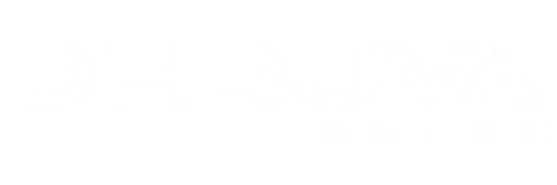
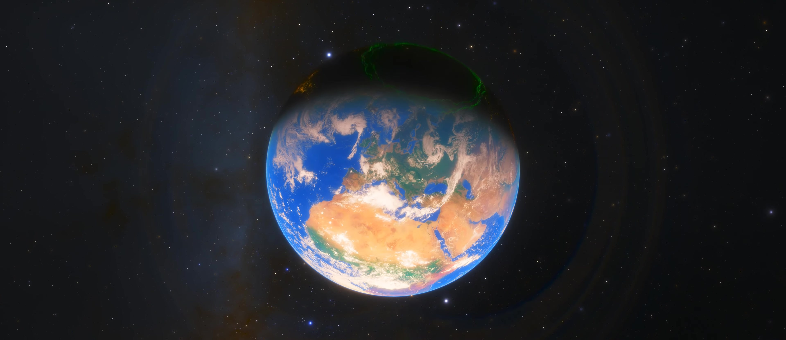
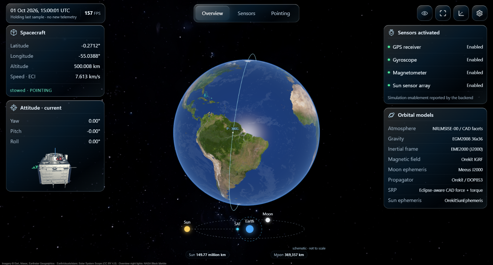
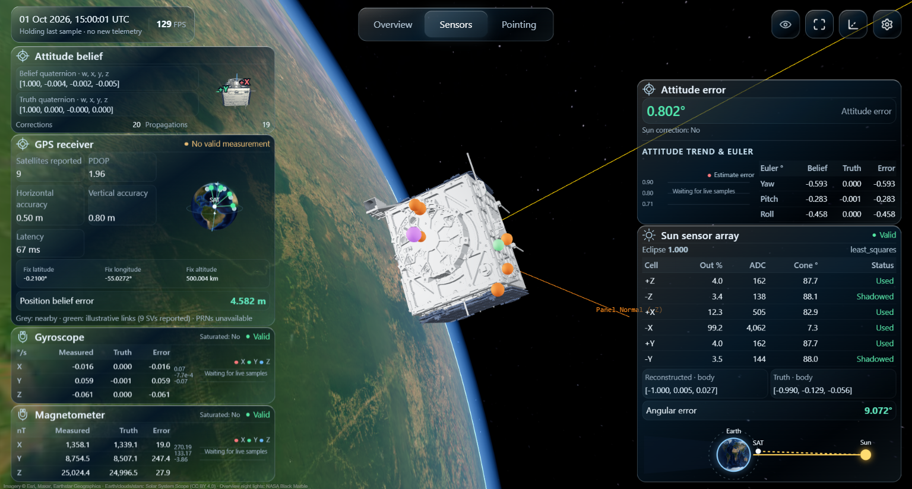

# ADCS Sim -- P-30XL Attitude Determination & Control System Simulator

> High-fidelity Model-Based Design simulator for the **Dhruva Space P-30XL** ADCS -- Orekit orbital physics, sensor emulation, pointing laws, RW + MTQ actuation, firmware SITL, and a React + Three.js mission viewer.


<p align="center">
  
</p>

## Table of Contents

- [1. Overview](#1-overview)
- [2. Features](#2-features)
- [3. Repository Structure](#3-repository-structure)
- [4. Prerequisites](#4-prerequisites)
- [5. Quick Start](#5-quick-start)
- [6. Configuration](#6-configuration)
- [7. Pointing Modes](#7-pointing-modes--controllers)
- [8. Physics Engine](#8-physics-engine)
- [9. Sensors](#9-sensors--navigation)
- [10. Actuators](#10-actuators)
- [11. Firmware SITL](#11-firmware-sitl-hardware-in-the-loop)
- [12. Viewer & API](#12-web-viewer--telemetry-api)
- [13. Tests](#13-validation--tests)
- [14. CAD Pipeline](#14-cad-pipeline)
- [15. Troubleshooting](#15-troubleshooting)
- [16. Docs & Credits](#16-additional-documentation)
- [17. Credits & License](#17-credits--license)

---

## 1. Overview

Closed-loop ADCS simulation for a ~500 km Sun-synchronous orbit (97 deg) P-30XL mission:

- **Orbit truth** -- Orekit Java propagator via JPype: EGM2008, NRLMSISE-00 drag + weather, SRP + eclipse, Sun/Moon ephemerides, IGRF field.
- **Attitude truth** -- Euler dynamics + quaternion kinematics at 10 Hz, coupled to faceted CAD surface physics.
- **Flight belief** -- emulated GPS, IMU (gyro + mag), sun-sensor array with noise/bias/latency/dropouts feeding a MEKF.
- **Control** -- B-dot detumble, Sun/Moon/Nadir, RW PD, periodic-gain LQR for MTQs, custom-quaternion, firmware-SITL.
- **Viewer** -- React + Three.js dashboard at `http://127.0.0.1:5000`.

Default: `500.003 km` circular SSO, epoch `2026-10-01T15:00:00Z`, DOP853, 10 Hz loop.

## Screenshots


*Live mission dashboard -- 3D spacecraft, Earth, orbit track and telemetry charts.*





---

## 2. Features

| Area | Capability |
|------|------------|
| Orbit | Orekit DOP853, EGM2008, NRLMSISE-00 + weather, SRP + shadow, dense-output interp |
| Attitude | Quaternion kinematics, Euler dynamics, 0.1 s tick, GG/aero/SRP/dipole torques |
| Spacecraft | CAD deployed (27.29 kg) / stowed (30.40 kg) + legacy 6 kg cube |
| Pointing | SUN_POINTING, SUN_POINTING_RW, RW, MOON, NADIR, SUN_SWEEP, NOMINAL_IN_ORBIT, KINEMATIC_ROBUSTNESS, CUSTOM, FIRMWARE_SITL |
| Sensors | GPS + nav filter, IMU + MEKF, 6-face sun array |
| Actuators | 4-wheel tetra array (55 deg, ~4 mN-m) + 3-axis MTQs (0.1 A-m2 quant) |
| SITL | UDP bridge to real flight firmware |
| Viewer | React 19 + Vite + Three.js 0.160 + GSAP 3.15 |
| Ops | Live speed reload, one-click setup, pytest + browser suites |

---

## 3. Repository Structure

```text
run_simulator.py                  # Main entry: physics + Flask viewer
app.py                            # Flask server (API + serves frontend/dist)
launcher.py                       # Alias -> run_simulator.main()
main.py                           # 24-h engine-vs-Orekit check (headless)
satellite_parameters.yaml         # PRIMARY CONFIG
advanced_satellite_parameters.yaml# CAD mass/inertia/facets/mounts
satellite_flight_visualisation.py # Main ADCS closed-loop sim (10 Hz)
engine/                           # Validated Orekit propagator wrapper
engine_adcs_bridge.py             # Bridge: ADCS <-> engine orbit provider
*_pointing.py                     # Controllers (sun, moon, nadir, RW, ...)
MTR_allocator.py / torque_distribution.py / cross_b_torque.py
calculate_disturbances.py / spacecraft_surface_physics.py
simulategps.py / gps_navigation.py
simulateimu.py / imu_navigation.py / imu_mount_settings.py
simulatesunsensor.py / sun_vector_eci.py
firmware_sitl_adapter.py / firmware_sitl_link.py / telemetry.py
pointing_client.py / control_states.py / store.py
frontend/                         # Vite + React + Three.js viewer
scripts/ / validation/ / orekit-data/
Setup.bat / setup.ps1 / requirements.txt
K_seq.npy / t_grid.npy            # Stored periodic-LQR gains
```

---

## 4. Prerequisites

| Requirement | Notes |
|-------------|-------|
| OS | Windows 10/11 64-bit (primary). Linux works with adapted steps. |
| Python | 3.12 64-bit with py launcher (enforced by setup). |
| Java | JDK 21 via jdk4py>=21,<22. JDK 25 breaks Orekit. |
| Node.js | LTS 18+ with npm -- frontend build only. |
| Resources | 8+ GB RAM, ~2 GB free. Port 5000 free. |

Python deps: flask, waitress, requests, numpy, scipy, pyyaml, orekit-jpype, jdk4py, astropy, pymap3d, matplotlib, trimesh, pytest. Frontend: react 19, three 0.160.0, gsap 3.15.0, vite 6.

---

## 5. Quick Start

### 5.1 One-click setup (Windows)

Double-click **Setup.bat** -- checks Python 3.12 / Node / orekit-data / port 5000, (re)creates .venv, installs deps, fixes JAVA_HOME, builds frontend, smoke-tests JVM + Orekit, boots sim until / returns 200.

```batch
Setup.bat                :: full setup (nuke .venv, reinstall, build, prove boot)
Setup.bat -ReuseVenv     :: keep .venv (fast re-run)
Setup.bat -KeepRunning   :: leave sim running after proof
Setup.bat -ViewerOnly    :: viewer only, skip physics/Java
Setup.bat -SkipFrontend  :: skip npm build
Setup.bat -NoSmoke       :: skip smoke tests
```

Log: setup.log.

### 5.2 Manual setup

```powershell
py -V:3.12 -m venv .venv
.\.venv\Scripts\Activate.ps1
python -m pip install --upgrade pip
pip install -r requirements.txt
$env:JAVA_HOME = (python -c "import jdk4py; print(jdk4py.JAVA_HOME)")
cd frontend; npm.cmd install; npm.cmd run build; cd ..
```

### 5.3 Run

```powershell
.\.venv\Scripts\python.exe run_simulator.py
# open http://127.0.0.1:5000
```

| Command | Purpose |
|---------|---------|
| python run_simulator.py | Full sim (physics + viewer). Use this. |
| python app.py | Viewer only, no physics/Java. |
| python launcher.py | Alias of run_simulator.py. |
| python main.py | 24-h engine-vs-Orekit headless check. |

Restart after YAML edits (except simulation.speed, hot-reloaded). Rebuild frontend + hard-refresh after viewer changes.

```powershell
cd frontend
npm.cmd run dev      # -> http://127.0.0.1:5173/frontend/ (proxies to Flask)
npm.cmd run preview  # preview production build
npm.cmd test         # regression checks
```

---

## 6. Configuration

All tuning lives in **satellite_parameters.yaml** (+ CAD overrides in advanced_satellite_parameters.yaml). Conventions: SI units unless named otherwise, body vectors [X, Y, Z], quaternions scalar-first [w, x, y, z] (body -> ECI), sigma = 1-sigma.

### Spacecraft model (CAD vs legacy)

```yaml
# satellite_parameters.yaml
use_advanced_satellite_model: true   # true = CAD, false = legacy cube
# advanced_satellite_parameters.yaml
panels_deployed: true                # true = deployed, false = stowed
```

| Model | Mass | COM (m) | Notes |
|-------|------|---------|-------|
| Deployed | 27.29 kg | (-0.01855, -0.01489, -0.16821) | Open panels, facet physics |
| Stowed | 30.40 kg | (-0.01682, -0.01421, -0.12967) | Closed config |
| Legacy | 6.0 kg | centered | 0.3 m cube, inertia [1.465, 1.176, 1.244] |

See CAD_CONFIGURATION.md.

### Pointing strategy

```yaml
pointing:
  strategy: legacy          # legacy | custom | firmware_sitl
  legacy_mode: SUN_POINTING
  custom:
    input: desired_quaternion
    quaternion: [1.0, 0.0, 0.0, 0.0]
    reference_quaternion: [1.0, 0.0, 0.0, 0.0]
```

- legacy -- dashboard selector (SUN_POINTING, RW, MOON, NADIR, SUN_SWEEP, SUN_POINTING_RW, NOMINAL_IN_ORBIT, KINEMATIC_ROBUSTNESS).
- custom -- scalar-first body->ECI quaternions via YAML or live client:

```python
from pointing_client import send_pointing_input
send_pointing_input([1, 0, 0, 0])
send_pointing_input(q_err, quaternion_error=True, reference_quaternion=q_ref)
```

- firmware_sitl -- external firmware owns actuation over UDP (see section 11).

### Sensor profiles

Values: custom / off / perfect / nominal / degraded / stress.

```yaml
sensor_profiles:
  gps: custom
  imu: stress
  gyroscope: custom
  magnetometer: custom
  sun_array: custom
```

Flags use_gyro_for_control, use_mag_for_control, use_attitude_estimate_for_control, render_estimated_attitude toggle estimate-vs-truth for A/B tests.

### Simulation speed

```yaml
simulation:
  speed: 10.0                  # sim-sec per real-sec (hot-reloaded, max 1 Hz)
  telemetry_publish_period_s: 0.25
  orbit_output_window_s: 0.5   # 0.1 restores legacy coupling
```

1.0 = realtime. Steps are never skipped -- if hardware lags, /api/latest reports simulation_speed_requested / simulation_speed_actual / simulation_lag_s. Charts redraw at most 2 Hz, keep last 30 sim-seconds.

---

## 7. Pointing Modes & Controllers

| File | Law |
|------|-----|
| periodic_gain_sun_pointing.py (+ K_seq.npy, t_grid.npy) | Periodic-gain LQR + governor, MTR Sun-pointing (body -Z -> Sun) |
| sun_pointing_rw.py / sun_pointing_rw_z.py | RW Sun-pointing PD variants |
| moon_pointing.py / nadir_pointing.py | Moon / Nadir (LVLH) tracking |
| nominal_in_orbit_pointing.py | Nominal orbital attitude |
| kinematic_robustness_pointing.py | Robust kinematic test law |
| satellite_rotational_dynamics_var_mag_field.py | Dynamics + DETUMBLE/RW/SUN switching (hysteresis 2.0 / 0.5 deg/s) |
| adcs_target_frame.py / quat2eul.py / sun_vector_eci.py | Frames + conversions |

Boresight: body -Z to Sun (2 DOF; spin about Sun line is free). Design derivation: CLAUDE.md.

---

## 8. Physics Engine

- Orbit (engine/ + engine_adcs_bridge.py): Orekit NumericalPropagator DOP853 -- central + EGM2008 Holmes-Featherstone, NRLMSISE-00 + CSSI weather, SRP + shadow. EngineOrbitProvider gives state, dense output, ECI/ECEF, Sun/Moon, IGRF, facet-coupled forces.
- Attitude: solve_ivp Euler + quaternion per 0.1 s tick; orbit segments extrapolate tick attitude; dense output resets at attitude updates.
- Disturbances: calculate_disturbances.py (GG, aero, SRP, residual dipole, per-channel switches); spacecraft_surface_physics.py unifies facet forces/moments for orbit + attitude + telemetry.
- Headless proof: python main.py -- engine-full vs raw-Orekit ~0 m; Kepler-only tens of km; EGM-only hundreds of m (24 h).

---

## 9. Sensors & Navigation

| Chain | Truth -> Measurement -> Belief |
|-------|-------------------------------|
| GPS | simulategps.py (bias/wander/noise/latency/dropouts ~1 Hz) -> gps_navigation.py (ECI pos/vel + dead-reckoning). Only ADCS knowledge is GPS-based. |
| IMU | simulateimu.py (mounts, bias walk, noise, quant) -> imu_navigation.py (sunlight-gated MEKF). Mounts via /api/imu/mounts, save via /api/imu/defaults. See imu_README.md. |
| Sun | simulatesunsensor.py (6 faces, 90 deg FOV, albedo, penumbra, self-shadowing) -> vector solution (min 3 cells). |

---

## 10. Actuators

- Reaction wheels (torque_distribution.py): tetra 4-wheel array, 55 deg wedge, pseudo-inverse + null-space desat. dh/dt = -T, inertia 5.4e-5 kg-m2.
- Magnetorquers (MTR_allocator.py, cross_b_torque.py): B-cross allocator; dipole quant 0.1 A-m2, 2 Hz ZOH; published as dipole x true_body_field.
- Limits defined once under spacecraft: in YAML, inherited by control + allocation.

---

## 11. Firmware SITL (Hardware-in-the-Loop)

pointing.strategy: firmware_sitl -- real firmware owns arbitration over non-blocking UDP (polled per tick, held through RK stages):

| Direction | Port | Format | Contents |
|-----------|------|--------|----------|
| In (wheels) | UDP 5104 | 3d (24 B) | wheel idx 0-3, mode 0, torque mNm |
| In (MTQ) | UDP 5105 | B3f (13 B) | ADS mode + dipole X/Y/Z A-m2 |
| Out (state) | UDP 5002 | 17d (136 B) | ECI pos/vel, quat, rate rad/s, UTC sim-time, body B-field T |
| Out (wheels) | UDP 5103 | 4x 3d | wheel idx, speed rpm, torque mNm per tick |

Status dots: red = no packet for 2 s, green = 2 s after connect or mode change, yellow = working. Tests: `validation/test_firmware_sitl.py`.

---

## 12. Web Viewer & Telemetry API

Flask serves frontend/dist/index.html + /frontend/* + /assets/*. Browser polls only /api/latest (gzip + ETag).

| Route | Methods | Purpose |
|-------|---------|---------|
| /api/latest | GET | Latest bundled telemetry (only continuous poll) |
| /update_telemetry | POST | Separate-process ingestion (compat) |
| /api/viewer/config | GET | Model, lighting, pointing bootstrap |
| /api/spacecraft | GET | Mass, model URL, config, COM |
| /api/imu/mounts | GET, POST | Read / apply mounts (next tick) |
| /api/imu/defaults | POST | Persist mounts to YAML |
| /api/pointing | GET, POST | Reference state; quat input (custom only) |
| /update/mode | POST | Mode command (strategy-gated) |
| /update/control/inputs | POST | Legacy yaw/pitch/roll sliders |
| /rw_telemetry, /mtr_telemetry | GET | Compat readouts (not polled) |
| / | GET | Built React app |
| /frontend/:path | GET | Compiled assets |
| /assets/:path | GET | Models, imagery, reference video |
| /ground/track/no/yaw/steering | GET | Compat redirect |

Viewer: worker CAD batching, GPU diagrams w/ async readback, 30-s chart windows, Earth/aurora/clouds, GSAP cosmic-zoom video, Overview/Sensors/Pointing pages. Details: frontend/README.md.

---

## 13. Validation & Tests

```powershell
python -m pytest validation/ -q
python -m pytest validation/test_spacecraft_configurations.py validation/test_sensor_navigation.py validation/test_dashboard_telemetry.py -q
python scripts/verify_cad_physics.py deployed
python scripts/verify_cad_physics.py stowed
python scripts/verify_sensor_changes.py
cd frontend; npm.cmd test
```

Browser/GPU (needs Chrome): terminal 1 -- python scripts/viewer_test_server.py; terminal 2 -- cd frontend; npm.cmd run test:browser. Orbit proof: python main.py.

---

## 14. CAD Pipeline

Requires cadquery-ocp, numpy, trimesh, pyyaml (+ gltf-transform CLI):

```powershell
python scripts/export_satellite_cad.py '../P-30XL Deployed 22-09-2026.STEP' deployed
python scripts/export_satellite_cad.py '../P-30XL Stoved 22-09-2026.STEP' stowed
npm.cmd install --prefix .tools/gltf @gltf-transform/cli
node scripts/extract_cad_mounts.mjs
python scripts/build_cad_configurations.py
```

Compress each GLB with gltf-transform meshopt (pos quant 16-bit). Physics uses a rectangular bus/panel macromodel from CAD bounds. Full notes: CAD_CONFIGURATION.md.

---

## 15. Troubleshooting

| Symptom | Fix |
|---------|-----|
| PS script blocked | Use Setup.bat (passes -ExecutionPolicy Bypass). |
| Python 3.12 not found | Install python.org 3.12 64-bit with py launcher. |
| port 5000 busy | Kill leftover python.exe via Task Manager. |
| JVM / Orekit crash | Force JDK 21: $env:JAVA_HOME = (python -c "import jdk4py; print(jdk4py.JAVA_HOME)"). Never JDK 25. |
| Viewer 503 | frontend/dist missing -- rebuild frontend. |
| Charts frozen | Physics warming up; check simulation_lag_s in /api/latest. |
| Edits invisible | YAML needs restart (except speed); viewer needs rebuild + Ctrl+Shift+R. |
| orekit-data/ missing | Re-extract zip or download orekit-data-main.zip as orekit-data/. |
| SITL red dot | No UDP 2 s -- check firmware, firewall, ports 5104/5105/5002/5103. |

Logs: setup.log, Flask console + browser devtools, hs_err_pid*.log (JVM).

---

## 16. Additional Documentation

- frontend/README.md -- viewer architecture, dev/build, perf.
- CAD_CONFIGURATION.md -- deployed/stowed physics + mass properties.
- GPS_DIAGRAM_INTEGRATION.md -- viewer GPS contract.
- imu_README.md -- IMU emulation + MEKF.
- frontend/assets/textures/README.md -- texture credits.
- CLAUDE.md -- full ADCS study (LTP diagnosis, periodic-LQR, validation).
- validation/README.md -- suite map.

---

## 17. Credits & License

Made by **Chirag Malik** -- malikchirag.2005@gmail.com -- [LinkedIn: malikchirag](https://linkedin.com/in/malikchirag) for Dhruva Space.

CAD STEP files, GLBs, textures, and reference footage retain their original licenses. Orekit by the Orekit community; 3D via Three.js, animation via GSAP. Please credit the author when reusing.

---
*Config changed? Restart (except simulation.speed). Viewer changed? Rebuild + hard-refresh. Happy flying.*
